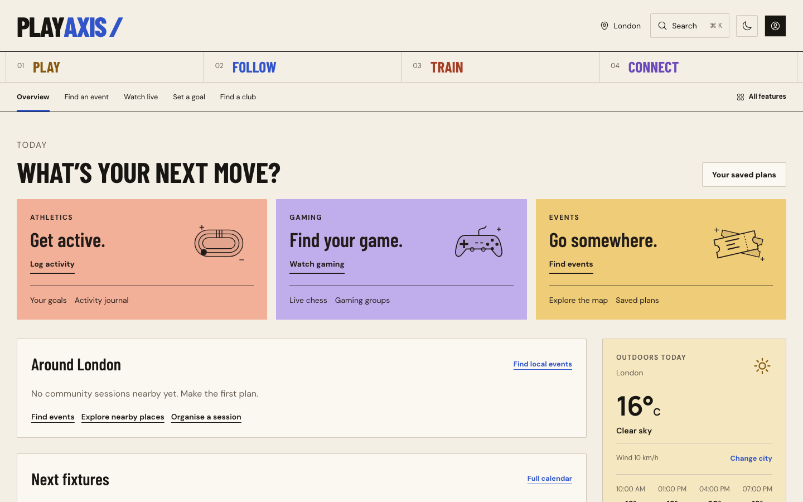

<h1 align="center">PlayAxis</h1>

<p align="center">Find sport and gaming events, follow teams, log your training and meet people who play what you play.</p>

<p align="center">
  <a href="https://playaxis.netlify.app"><strong>Live site</strong></a> ·
  <a href="docs/architecture.md">Architecture</a> ·
  <a href="docs/setup.md">Setup and providers</a> ·
  <a href="docs/design.md">Design</a>
</p>

<p align="center">
  
  
  
</p>

[](https://playaxis.netlify.app)

---

### What it does

| Area | What you can do |
| --- | --- |
| **Play** | Find local organiser listings and community sessions, RSVP, see places and events on a map, save plans, download calendar files |
| **Follow** | Fixtures, results and standings across seven league feeds, follow teams, watch Twitch sport and esports broadcasts, live chess |
| **Train** | Keep a private activity journal, time and edit workouts, set weekly and monthly goals, chart progress, compare sessions |
| **Connect** | Community posts with reactions and comments, clubs, group sessions and profiles |

Browsing works without an account. Logging activity, setting goals, joining sessions and posting need one.

### Quick start

Requires Node.js 22 and Python 3.11 or newer.

```sh
# Backend
python3 -m venv .venv-playaxis
source .venv-playaxis/bin/activate
pip install -r backend/requirements-dev.txt
cd backend && python dev.py
```

```sh
# Frontend, in a second terminal
cd frontend
npm ci
npm start
```

Open http://localhost:3000. API documentation is at http://localhost:8000/docs.

The backend uses a local SQLite file by default. Some data sources need free API keys; copy [backend/.env.example](backend/.env.example) to `backend/.env` and see [setup and providers](docs/setup.md) for what each key unlocks.

### How it is built

- **Frontend:** React 18 with React Router, Leaflet maps and Tailwind CSS.
- **Backend:** FastAPI with SQLAlchemy and Alembic migrations, on SQLite or PostgreSQL.
- **Data:** live fixtures, standings, events, streams, weather and map data from public providers including football-data.org, OpenLigaDB, Jolpica F1, nflverse, BALLDONTLIE, Ticketmaster, Twitch, Lichess, Open-Meteo and OpenStreetMap. Coverage and limits for each are listed in [setup and providers](docs/setup.md).
- **Hosting:** the frontend is on Netlify, which proxies API calls to the backend on Koyeb.

Where a provider cannot supply something, the app says so and does not fill the gap with invented data. NBA standings, for example, are computed from completed games because the free feed does not include them.

### Tests

```sh
# Backend, from the repository root
.venv-playaxis/bin/python -m pytest -q

# Frontend
cd frontend
CI=true npm test -- --watchAll=false --runInBand
npm run build
```

See [verification scope](docs/verification.md) for what the tests do and do not cover.

### Credits

[MIT licensed](LICENSE). Photography by [Hannah Coleman on Unsplash](https://unsplash.com/photos/man-running-on-outdoor-track-UFs5bKHgo4U). Map data © OpenStreetMap contributors. NFL schedules use [nflverse data under CC BY 4.0](https://github.com/nflverse/nflverse-data/blob/main/LICENSE.md). Provider data and media keep their own terms. Built by [Oliver Perrin](https://github.com/OliverPerrin).
